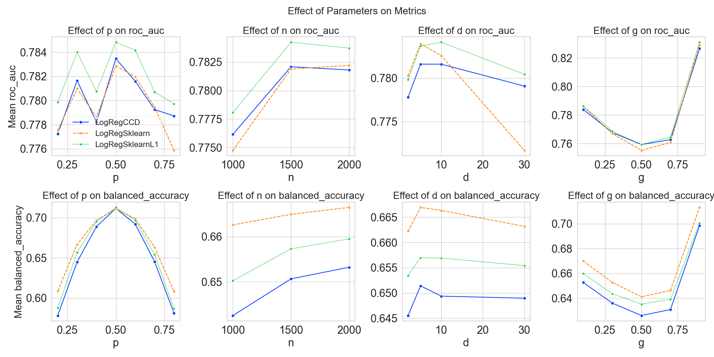

# Cyclic Coordinate Descent for Logistic Regression with Lasso regularization

This notebook presents the implementation of Cyclic Coordinate Descent (CCD) algorithm for parameter
estimation in regularized logistic regression with l1 (lasso) penalty and compares it with standard
logistic regression model without regularization.

In particular it involves the implementation of such algorithm from scratch and comparison to the Logistic Regression available in scikit-learn package.

The details of the data and algorithms used are in the solution.ipynb and in the ./report/report.pdf

# Using a different dataset

TODO: Instruction how to use the Dataset class. What input data does it expect etc.

# Requirements

All the scripts have been executed with [Python 3.13.2](https://www.python.org/). [Pyenv](https://github.com/pyenv/pyenv) can be used to easily manage your python installations. It is recommended to create a python environment in the cloned repository:

```
python -m venv --prompt venv .\venv
```

Afterwards activate the environment (./venv/Scripts) and install the requirements present in requirements.txt:

```
pip install -r requirements.txt
```

All the scripts are formatted with the Black formatter.

# Reproducibility

To ensure reproducibility: download the datasets from the provided links, use the same Python version (Requirements) and don't change the seeds. The experiments have been performed on a Windows 11 Intel i5 machine.

# Directory structure

```
.
├── datasets/
├── report/
├── results/
└── solution.ipynb
```




TODO: Add here 1-2 more images, preferably of comparison on real dataset and maybe how the weights change with lambda or similar
