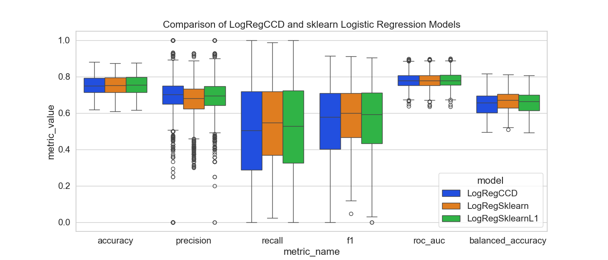
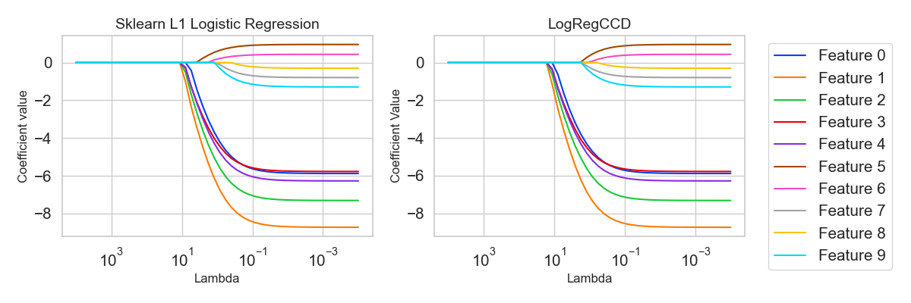

# Cyclic Coordinate Descent for Logistic Regression with Lasso regularization

This notebook presents the implementation of Cyclic Coordinate Descent (CCD) algorithm for parameter
estimation in regularized logistic regression with l1 (lasso) penalty and compares it with standard
logistic regression model without regularization.

In particular it involves the implementation of such algorithm from scratch and comparison to the Logistic Regression available in scikit-learn package.

The details of the data and algorithms used are in the solution.ipynb and in the ./report/report.pdf

# Using a different dataset

There are 3 ways in case you want to use a separate dataset:

1. Wrapping the new dataset in the Dataset class:

   1. Prepare the dataset: create a Pandas dataframe where the last column is the target and the rest of the columns are features. If your dataset is in the .arff format you should be able to load it with load_dataset() function.
   2. Create a new instance of the Dataset class. As arguments pass the name, source df, and optionally preprocessing steps (available as methods of the Dataset class)
   3. As a result you will receive an object with X and y properties that are numpy arrays ready for further processing.
   4. Create train and test sets if needed with scikit's train_test_split
   5. Create an instance of LogRegCCD, use the fit() method on the train set and then validate() with chosen metric (callable function) to receive a score.

---

If all your new datasets are in the .arff format. All columns are numerical, and the response variable is binary. Place them in a single folder and use the below code snippet:

```{python}
# Any necessary imports and class definitions (Dataset class, LogRegCCD class, load_dataset function)

datasets = load_datasets(path_to_datasets)

# Choose any of the preprocessing steps you want to apply to all datasets
preprocessing_steps = [
    Dataset.fill_missing_values,
    Dataset.remove_colinear_features,
    Dataset.applyStandardScaler,
]

for i in range(len(datasets)):
    datasets[i] = Dataset(datasets[i]["name"], datasets[i]["data"], preprocessing_steps)
```

However it might be the case that your dataset first needs to be preprocessed. In the notebook in the **Classes & Functions** section you can find many datasets that go through preprocessing steps, such as merging of classes, removing features with only nan values etc.

Assuming your dataset is in .arff format (if it is not, please write necessary code to load your dataset into a dataframe, where the last column is the response variable). The code below examplifies how to merge classses and remove features with only nan values:

```{python}
# Any necessary imports and class definitions (Dataset class, LogRegCCD class, load_dataset function, scikit's functions, numpy, pandas)

data = load_dataset("dataset_path")


# Identify the majority class
majority_class = data[data.columns[-1]].mode()[0]

# Convert majority class to 1 and others to 0
data[data.columns[-1]] = (data[data.columns[-1]] == majority_class).astype(int)
dataset = Dataset(
   "BussinessDescriptionsDataset",
   data,
   [
         Dataset.fill_missing_values,
         Dataset.remove_colinear_features,
         Dataset.applyStandardScaler,
   ],
)

# Remove any leftover nan values after conversion to numpy 
# The nan values imputation is done via column mean. If all column values were none or for some reason the conversion from pandas to numpy failed for a specific feature then it will be removed here.

nan_count = np.isnan(dataset.X).sum(axis=0)

columns_with_nans = np.where(nan_count > 0)[0]

dataset.X = np.delete(dataset.X, columns_with_nans, axis=1)

# Now you can train the LogRegCCD model

X_train, X_test, y_train, y_test = train_test_split(
    dataset.X, dataset.y, test_size=0.2, random_state=42
)

logRegCCD = LogRegCCD()

logRegCCD.fit(X_train, y_train)

logRegCCD.validate(X_test, y_test, metric=accuracy_score)
```

---

2. Creating a class inheriting from the Dataset class

   1. Create a new class that inherits from the Dataset class.
   2. In the **init**() load the dataset (you may use the load_dataset() class if it's in the .arff format)
   3. Make sure your loaded data is a Pandas dataframe where the last column is the target and the rest of the columns are features
   4. Call super().**init**() with name, source df, and optionally preprocessing steps (available as methods of the Dataset class)
   5. Once you create an instance of the new class you will receive an object with X and y properties that are numpy arrays ready for further processing.
   6. Create train and test sets if needed with scikit's train_test_split
   7. Create an instance of LogRegCCD, use the fit() method on the train set and then validate() with chosen metric (callable function) to receive a score

3. Manually creating a new dataframe

   1. Load and preprocess your data to a pandas Dataframe (if your data is in the .arff format then use the load_dataset() function)
   2. Convert the features and the response variable to numpy arrays. Make sure the response classes are numeric.
   3. Create train and test sets if needed with scikit's train_test_split
   4. Create an instance of LogRegCCD, use the fit() method on the train set and then validate() with chosen metric (callable function) to receive a score

# Requirements

All the scripts have been executed with [Python 3.13.2](https://www.python.org/). [Pyenv](https://github.com/pyenv/pyenv) can be used to easily manage your python installations. It is recommended to create a python environment in the cloned repository:

```
python -m venv --prompt venv .\venv
```

Afterwards activate the environment (./venv/Scripts) and install the requirements present in requirements.txt:

```
pip install -r requirements.txt
```

All the scripts are formatted with the Black formatter.

# Reproducibility

To ensure reproducibility: download the datasets from the provided links and place them in the datasets folder (look dir structure below), use the same Python version (Requirements) and don't change the seeds. The experiments have been performed on a Windows 11 Intel i5 machine.

To reproduce all results simply execute the notebook cells one by one. Alternatively execute the _Imports & Consts_ and _Classes & Functions_ sections and then execute sections of interest or just use the defined functions.

Used datasets:

- [SpeechTreatmentDataset](https://www.openml.org/search?type=data&sort=runs&status=active&qualities.NumberOfClasses=%3D_2&qualities.NumberOfFeatures=between_100_1000&id=1484)
- [ArrhythmiaDataset](https://www.openml.org/search?type=data&sort=runs&status=active&qualities.NumberOfClasses=%3D_2&qualities.NumberOfFeatures=between_100_1000&id=1017)
- [DBWorldSubjectsDataset](https://www.openml.org/search?type=data&sort=qualities.NumberOfInstances&status=active&order=asc&qualities.NumberOfFeatures=between_100_1000&format=ARFF&qualities.NumberOfClasses=gte_2&id=1563)
- [SemeionDataset](https://www.openml.org/search?type=data&status=active&id=41973)

# Directory structure

```
.
├── datasets/
│   ├── phpIsie2e.arff
│   ├── file53b824492a45.arff
│   ├── arrhythmia.arff
│   └── phpVDlhKL.arff
├── report/
├── results/
├── requirements.txt
├── README.md
└── solution.ipynb
```






